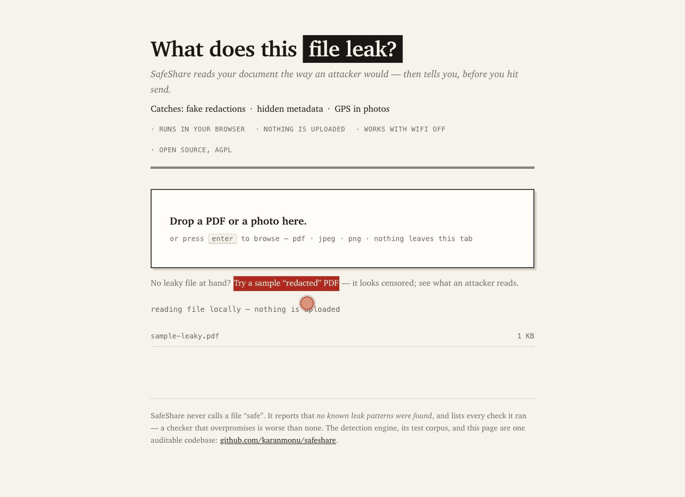

# SafeShare

Check what your file leaks — before you send it.

**[Try it live →](https://karanmonu.github.io/safeshare/)** — one click on the sample file shows the whole idea:



That black box over the account number? If you can still copy the text underneath,
so can everyone you send it to — and any AI assistant will extract it in one
sentence. Thousands of "redactions" in the DOJ's 2025 Epstein files release failed
exactly this way.

SafeShare runs entirely in your browser. No upload, no signup, no analytics.
Load the page, turn off your internet, and it still works — that's the point:
a document you need to check for leaks is a document you must not upload anywhere,
including to an AI chatbot.

## What it checks

**PDF**

- Text recoverable under dark covers — detected by rendering the page the way a
  human sees it and comparing against what a machine can extract, so it catches
  vector rectangles, dark annotations, and OCR text under scanned black bars with
  one detector (see [ADR 0001](docs/adr/0001-pixel-truth-detection.md)). It shows
  you exactly the text an attacker would recover.
- /Redact annotations that were never applied — marked for removal, removed nothing.
- Document information dictionary — author, software, editing timeline.
- XMP metadata, including revision history (`xmpMM:History`).
- Embedded file attachments riding inside the document.

**JPEG / PNG**

- GPS coordinates (the "photo of my house" leak).
- EXIF identity fields — camera, serial number, owner, software, timestamps.
- IPTC/Photoshop blocks, XMP packets, PNG text/EXIf/tIME chunks.

## What it fixes

- PDF: strips the info dictionary and XMP metadata, then re-audits its own output.
- Images: lossless metadata strip — segments are removed, pixels are never re-encoded.

It does **not** yet fix fake redactions (that requires true glyph removal —
roadmap below). v0 detects them and shows you the blast radius, which is the
half of the problem nobody checks.

## What it will never say

SafeShare never says a file is "safe". It says **no known leak patterns were
found**, and lists the checks it ran, because a checker that overpromises is
worse than no checker. The detection corpus is generated, versioned, and run in
CI ([test/](test/)) so every claim in this README is pinned by a test.

## Code layout

```
index.html, styles.css      the page — static, CSP-locked, no build step
src/engine/                 detection + fixing; framework-free ES modules that
                            run unchanged in the browser and in Node CI
  pdf-analyzer.js           pixel-truth detection, annotations, metadata, attachments
  pdf-fixer.js              info-dict + XMP removal (re-audited by its own analyzer)
  exif.js                   JPEG/PNG analysis and lossless strip (orientation preserved)
src/ui/app.js               drop-zone glue, no logic beyond presentation
vendor/                     pinned pdf.js + pdf-lib builds (no CDN — offline is the trust proof)
test/make-corpus.mjs        generates deliberately-leaky documents with known ground truth
test/run-tests.mjs          runs the browser engine against the corpus in Node
docs/adr/                   why detection works the way it does
```

## Run it

It's a static page — any web server works:

```
npx serve .        # then open http://localhost:3000
```

Tests (Node 22+):

```
npm ci
npm test           # generates the leak corpus, runs the engine against it
```

The same engine files run in the browser and in Node — what CI tests is what
users get.

## Roadmap

- [x] pixel-truth fake redaction detection (vector / annotation / OCR-layer)
- [x] metadata, XMP, attachment findings
- [x] lossless EXIF/PNG strip + PDF metadata strip
- [ ] text-color check to kill the light-text-on-dark-design false positive
- [ ] true redaction fixing via MuPDF WASM (glyph removal, region rasterize)
- [ ] ID masking module: Aadhaar/PAN number detection and true masking
- [ ] exact-KB export for government portal uploads
- [ ] CLI + GitHub Action: fail CI when a published PDF leaks

## License

AGPL-3.0-or-later. Bundled pdf.js is Apache-2.0, pdf-lib is MIT.
